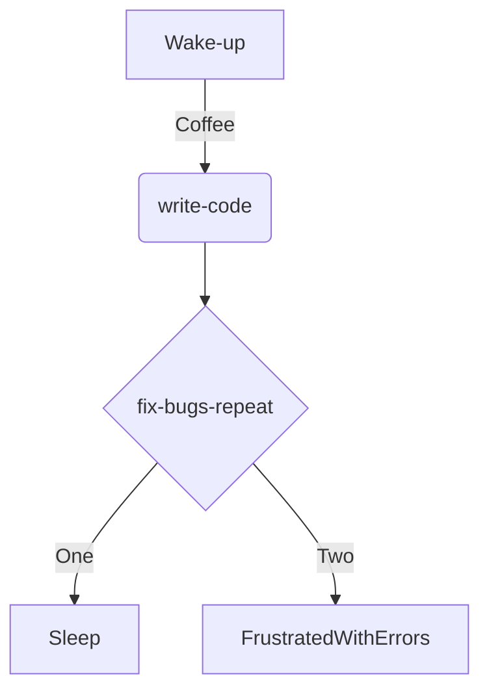

<a href="https://github.com/luizfrz"></a>


<div align="center">

</div>


## Resume
<p align="left"> 

 
 My name is Luiz, and I'm currently studying Software Engineering. I'm interested in languages like Python, particularly for data analysis, as well as PHP for building databases (Python's also been helpful for that) and JavaScript. While my main focus isn't web development (front-end), I occasionally jump in to practice a bit.
In my free time, I enjoy gaming, especially RPGs and action games, but I'm into all kinds of genres. I’m also fluent in English.
This is just a quick overview of me. Feel free to check out my work on GitHub to see my projects :)
</p>


<h2 align="center">Main development ⚙️</h2>
<p align="right">
<div>
 
```PHP
$languages = array(
    "language" => "python",
    "language" => "PHP",
);
```
 </div>
 
```Python
tools = ["Vscode", "Git", "pycharm", "MariaDB". "MongoDb","Googlecloud"]
print(tools)
```


<div align="left">
   
      </a>
    </td>
  
  
  
  
  
  
  
  
  
  
  
   
 
  
</div>
   
# Contact 
<a href="luizfranca2005@gmail.com"></a>  <a href="https://www.linkedin.com/in/luiz-fran%C3%A7a-127262269/"></a> 
# Portfolio
 
 
 **LINK**:  

## Hobby 
**Playstation and Steam**
<div id="icones">
<a target="_blank" href="https://steamcommunity.com/user/hpvv-fttf/VBWHMKHG/?fbclid=PAZXh0bgNhZW0CMTEAAaZA8gNmufKhHLs6mXjHLORhn7MPFhYS_c0CG4ecBy5pdOkvuVW66a5EsDk_aem_tS2_USuyhEevqjznvxIczA" > </a> <a target="_blank" href="https://profile.playstation.com/Kazumi_Kiyomi/add" > </a>
</div>

# My contributions 🏆

<p align="center"><a href="https://referral.hackthebox.com/mz7Kryv" target="_blank">
 
 
</p>  

[](https://github.com/ashutosh00710/github-readme-activity-graph)


# Streak 🔥

<div align="center">
<a href="https://git.io/streak-stats"></a>
</div>


<div>

## City contributions 🏙️
<div align="center">
<a href="https://honzaap.github.io/GithubCity/?name=luizfrz&year=2025"></a>
</div>


