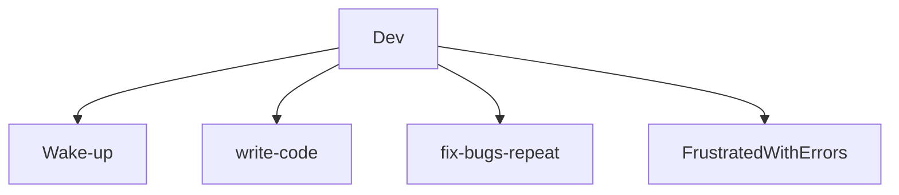

<a href="https://github.com/luizfrz"></a>

## Resume
<p align="left"> 
 My name is Luiz, and I'm currently studying Software Engineering. I'm interested in languages like Python, particularly for data analysis, as well as PHP for building databases (Python's also been helpful for that) and JavaScript. While my main focus isn't web development (front-end), I occasionally jump in to practice a bit.
In my free time, I enjoy gaming, especially RPGs and action games, but I'm into all kinds of genres. I’m also fluent in English.
This is just a quick overview of me. Feel free to check out my work on GitHub to see my projects :)
</p>

<h2 align="center">Main development ⚙️</h2>
<p align="right">
<div>
 
```PHP
$languages = array(
    "language" => "python",
    "language" => "PHP",
    "language" => "javascript",
);
```
 </div>
 
```Python
tools = ["Git"]
print(tools[0])
```
   
# Contact 

**Email:** `Luizfranca2005@gmail.com`

**Linkedin:** `https://www.linkedin.com/in/luiz-fran%C3%A7a-127262269/`

**Portfolio:** ` `

**Playstation and Steam**
<div id="icones">
<a target="_blank" href="https://steamcommunity.com/user/hpvv-fttf/VBWHMKHG/?fbclid=PAZXh0bgNhZW0CMTEAAaZA8gNmufKhHLs6mXjHLORhn7MPFhYS_c0CG4ecBy5pdOkvuVW66a5EsDk_aem_tS2_USuyhEevqjznvxIczA" > </a> <a target="_blank" href="https://profile.playstation.com/Kazumi_Kiyomi/add" > </a>
</div>

# My contributions 🏆

<p align="center"><a href="https://referral.hackthebox.com/mz7Kryv" target="_blank">
 
 
</p>  

[](https://github.com/ashutosh00710/github-readme-activity-graph)


<details>
<summary>Dev Daily 💻</summary>
 

</details>
<details>
 <summary>3D Triangule </summary>
 
```stl
solid cube_corner
  facet normal 0.0 -1.0 0.0
    outer loop
      vertex 0.0 0.0 0.0
      vertex 1.0 0.0 0.0
      vertex 0.0 0.0 1.0
    endloop
  endfacet
  facet normal 0.0 0.0 -1.0
    outer loop
      vertex 0.0 0.0 0.0
      vertex 0.0 1.0 0.0
      vertex 1.0 0.0 0.0
    endloop
  endfacet
  facet normal -1.0 0.0 0.0
    outer loop
      vertex 0.0 0.0 0.0
      vertex 0.0 0.0 1.0
      vertex 0.0 1.0 0.0
    endloop
  endfacet
  facet normal 0.577 0.577 0.577
    outer loop
      vertex 1.0 0.0 0.0
      vertex 0.0 1.0 0.0
      vertex 0.0 0.0 1.0
    endloop
  endfacet
endsolid

```
</details>
<details>
 <summary>Chess♟️</summary>
 
<h3 align="center">A classic Chess</h3>
<p align="center">
  
</p>
<p align="center">It's Black's turn</p>
<table align="center">
  <tbody>
    <tr>
      <td align="center">:eight:</td>
      <td align="center">♜      </td>
      <td align="center">
        <details>
          <summary>♞</summary>
          <a href="https://o.charles-chrismann.fr/chess/move?x1=1&y1=0&x2=0&y2=2">a6</a>
          <a href="https://o.charles-chrismann.fr/chess/move?x1=1&y1=0&x2=2&y2=2">c6</a>
        </details>
      </td>
      <td align="center">♝      </td>
      <td align="center">♛      </td>
      <td align="center">♚      </td>
      <td align="center">♝      </td>
      <td align="center">
        <details>
          <summary>♞</summary>
          <a href="https://o.charles-chrismann.fr/chess/move?x1=6&y1=0&x2=5&y2=2">f6</a>
          <a href="https://o.charles-chrismann.fr/chess/move?x1=6&y1=0&x2=7&y2=2">h6</a>
        </details>
      </td>
      <td align="center">♜      </td>
    </tr>
    <tr>
      <td align="center">:seven:</td>
      <td align="center">
        <details>
          <summary>♟</summary>
          <a href="https://o.charles-chrismann.fr/chess/move?x1=0&y1=1&x2=0&y2=3">a5</a>
          <a href="https://o.charles-chrismann.fr/chess/move?x1=0&y1=1&x2=0&y2=2">a6</a>
        </details>
      </td>
      <td align="center">
        <details>
          <summary>♟</summary>
          <a href="https://o.charles-chrismann.fr/chess/move?x1=1&y1=1&x2=1&y2=3">b5</a>
          <a href="https://o.charles-chrismann.fr/chess/move?x1=1&y1=1&x2=1&y2=2">b6</a>
        </details>
      </td>
      <td align="center">
        <details>
          <summary>♟</summary>
          <a href="https://o.charles-chrismann.fr/chess/move?x1=2&y1=1&x2=2&y2=3">c5</a>
          <a href="https://o.charles-chrismann.fr/chess/move?x1=2&y1=1&x2=2&y2=2">c6</a>
        </details>
      </td>
      <td align="center">
        <details>
          <summary>♟</summary>
          <a href="https://o.charles-chrismann.fr/chess/move?x1=3&y1=1&x2=3&y2=3">d5</a>
          <a href="https://o.charles-chrismann.fr/chess/move?x1=3&y1=1&x2=3&y2=2">d6</a>
        </details>
      </td>
      <td align="center">
        <details>
          <summary>♟</summary>
          <a href="https://o.charles-chrismann.fr/chess/move?x1=4&y1=1&x2=4&y2=3">e5</a>
          <a href="https://o.charles-chrismann.fr/chess/move?x1=4&y1=1&x2=4&y2=2">e6</a>
        </details>
      </td>
      <td align="center">
        <details>
          <summary>♟</summary>
          <a href="https://o.charles-chrismann.fr/chess/move?x1=5&y1=1&x2=5&y2=3">f5</a>
          <a href="https://o.charles-chrismann.fr/chess/move?x1=5&y1=1&x2=5&y2=2">f6</a>
        </details>
      </td>
      <td align="center">
        <details>
          <summary>♟</summary>
          <a href="https://o.charles-chrismann.fr/chess/move?x1=6&y1=1&x2=6&y2=3">g5</a>
          <a href="https://o.charles-chrismann.fr/chess/move?x1=6&y1=1&x2=6&y2=2">g6</a>
        </details>
      </td>
      <td align="center">
        <details>
          <summary>♟</summary>
          <a href="https://o.charles-chrismann.fr/chess/move?x1=7&y1=1&x2=7&y2=3">h5</a>
          <a href="https://o.charles-chrismann.fr/chess/move?x1=7&y1=1&x2=7&y2=2">h6</a>
        </details>
      </td>
    </tr>
    <tr>
      <td align="center">:six:</td>
      <td align="center">‎       </td>
      <td align="center">‎       </td>
      <td align="center">‎       </td>
      <td align="center">‎       </td>
      <td align="center">‎       </td>
      <td align="center">‎       </td>
      <td align="center">‎       </td>
      <td align="center">‎       </td>
    </tr>
    <tr>
      <td align="center">:five:</td>
      <td align="center">‎       </td>
      <td align="center">‎       </td>
      <td align="center">‎       </td>
      <td align="center">‎       </td>
      <td align="center">‎       </td>
      <td align="center">‎       </td>
      <td align="center">‎       </td>
      <td align="center">‎       </td>
    </tr>
    <tr>
      <td align="center">:four:</td>
      <td align="center">‎       </td>
      <td align="center">‎       </td>
      <td align="center">‎       </td>
      <td align="center">‎       </td>
      <td align="center">‎       </td>
      <td align="center">‎       </td>
      <td align="center">‎       </td>
      <td align="center">‎       </td>
    </tr>
    <tr>
      <td align="center">:three:</td>
      <td align="center">‎       </td>
      <td align="center">‎       </td>
      <td align="center">‎       </td>
      <td align="center">‎       </td>
      <td align="center">‎       </td>
      <td align="center">‎       </td>
      <td align="center">‎       </td>
      <td align="center">‎       </td>
    </tr>
    <tr>
      <td align="center">:two:</td>
      <td align="center">♗      </td>
      <td align="center">♙      </td>
      <td align="center">♙      </td>
      <td align="center">♙      </td>
      <td align="center">♙      </td>
      <td align="center">♙      </td>
      <td align="center">♙      </td>
      <td align="center">♙      </td>
    </tr>
    <tr>
      <td align="center">:one:</td>
      <td align="center">♖      </td>
      <td align="center">♘      </td>
      <td align="center">‎       </td>
      <td align="center">♕      </td>
      <td align="center">♔      </td>
      <td align="center">♗      </td>
      <td align="center">♘      </td>
      <td align="center">♖      </td>
    </tr>
  <tr>
    <td align="center"></td>
    <td align="center">🇦</td>
    <td align="center">🇧</td>
    <td align="center">🇨</td>
    <td align="center">🇩</td>
    <td align="center">🇪</td>
    <td align="center">🇫</td>
    <td align="center">🇬</td>
    <td align="center">🇭</td>
    </tr>
  </tbody>
</table><h3 align="center">
<a href="https://o.charles-chrismann.fr/chess/new">Reset Game</a>
</h3>

</details>
