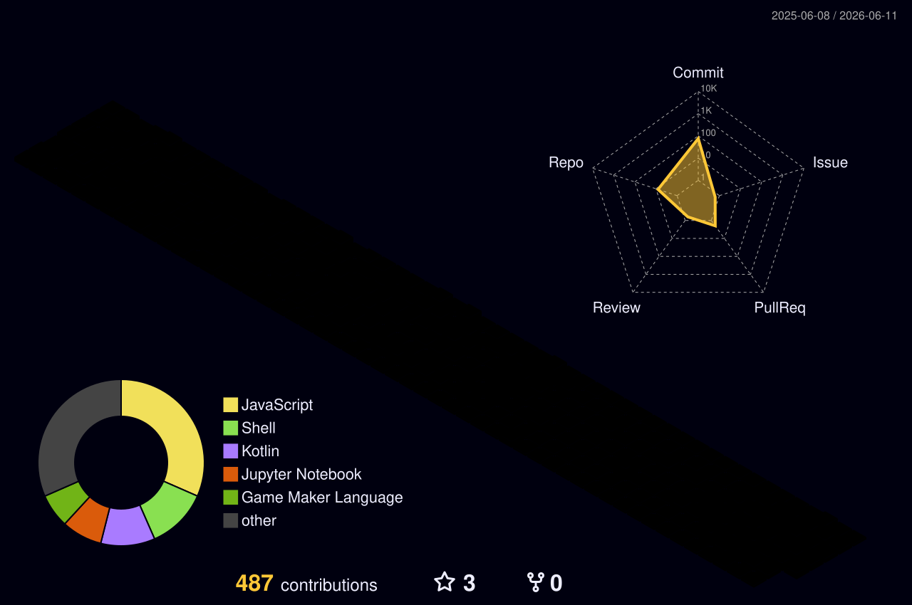

 

 

  
 Full-Stack Developer with experience in the PHP ecosystem (Laravel) and JavaScript (React/Next.js).
Hands-on experience across the entire software development lifecycle, including quality assurance (QA),
process automation, and system evolution. Focused on best practices such as SOLID principles, Clean
Code, performance, and scalability. Proven experience in automation leading to significant productivity
gains within teams     

<h2 align="center">Main development</h2>

 
 
 
 
 
 
 
 
 
 
   
# My contributions 🏆

<a href="https://referral.hackthebox.com/mz7Kryv" target="_blank">
 
 

  

